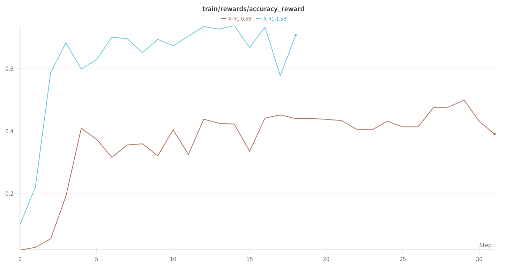

# X-R1


X-R1 aims to build an easy-to-use, low-cost training framework based on reinforcement learning to accelerate the development of Scaling Post-Training

Inspired by [DeepSeek-R1](https://github.com/deepseek-ai/DeepSeek-R1) and [open-r1](https://github.com/huggingface/open-r1) , we produce minimal-cost for training 0.5B R1-Zero "Aha Moment"💡 from base model


## Feature

- 4x3090/4090 GPUs training 1hour, 💰cost < 10 dollar, 10min 37'step output “aha Moment“ 💡
- 0.5B scale model RL training
- support BIGGER model: 1.5B/7B/32B...
- We supply 0.75k/1.5k/7.5k dataset for fast train loop
- We logging GRPO online sampling data to log file

[ ] support QLoRA GRPO Training

## News

- 2025.02.12 Release X-R1-1.5B config/wandb/model/log
- 2025.02.12: Release X-R1 first version

## Result

### Overview

We would share training details about  config/wandb/model/log, also evaluation results.

| Model                 | 0.5B                     | 1.5B                                                         | 3B   | 7B   |
| --------------------- | ------------------------ | ------------------------------------------------------------ | ---- | ---- |
| TargetModel           |                          | xiaodongguaAIGC/X-R1-1.5B                                    |      |      |
| Log                   |                          | [[link]](https://drive.google.com/file/d/11tBShY206Pu_SxWE0M-mG2_Cdf9mFNig/view?usp=sharing) |      |      |
| Wandb                 |                          | [link]                                                       |      |      |
| Test                  |                          | [link]                                                       |      |      |
| GPU                   | 4x3090                   | 4x3090                                                       |      |      |
| Base                  | Qwen/Qwen2.5-0.5B        | Qwen/Qwen2.5-0.5B                                            |      |      |
| Data                  | xiaodongguaAIGC/X-R1-750 | xiaodongguaAIGC/X-R1-750                                     |      |      |
| Config: recipes       |                          | X_R1_zero_1dot5B_config.yaml                                 |      |      |
| num_generations       | 16                       | 8                                                            |      |      |
| max_completion_length | 512                      | 1024                                                         |      |      |
| num_train_epochs      | 3                        | 3                                                            |      |      |
| Times                 |                          | 1:59:06                                                      |      |      |

### running

0.5B, 4x3090.  if you have 4 GPUs, you should set `--num_processes=3`.  One GPU deploy vLLM as online inference engine, for faster GRPO sampling

example: 4x4090, 3epochs, training time, ~1h20min

```shell
ACCELERATE_LOG_LEVEL=info \
accelerate launch \
--config_file recipes/zero3.yaml \
--num_processes=3 \
src/x_r1/grpo.py \
--config recipes/X_R1_zero_0dot5B_config.yaml \
> ./output/x_r1_0dot5_sampling.log 2>&1
```

### accuracy reward



### Aha Moment:

***Wait**, that doesn't match either of our options. It seems like I made a **mistake** in my **assumptions**. **Let's go back** to the original equations*


## Installation

required: cuda> 12.4

```
conda create -n xr1 python=3.11
conda activate xr1
```

and

```
pip install -r requirements.txt
```

for test environment:

```
mkdir output
```

\[option\]: single GPU:

```shell
ACCELERATE_LOG_LEVEL=info \
accelerate launch \
--config_file recipes/zero1.yaml \
--num_processes=1 \
src/x_r1/grpo.py \
--config recipes/X_R1_test_env_single.yaml \
> ./output/x_r1_test_sampling.log 2>&1
```

\[option\]Multi-GPU:

```shell
ACCELERATE_LOG_LEVEL=info \
accelerate launch \
--config_file recipes/accelerate_configs/zero3.yaml \
--num_processes=1 \
src/x_r1/grpo.py \
--config recipes/x_r1_test_sampling.yaml \
> ./output/test.log 2>&1
```

and we check log file: `./output/test.log`

## Todo

- support QloRA GRPO Trainning
- Release 7B config/result
- add more rule reward
- support more base model
- add benchmark evaluation reuslt

## About

If you have any suggestions, please contact: dhcode95@gmail.com

## Acknowledge

[Open-R1](https://github.com/huggingface/open-r1), [TRL](https://github.com/huggingface/trl)
