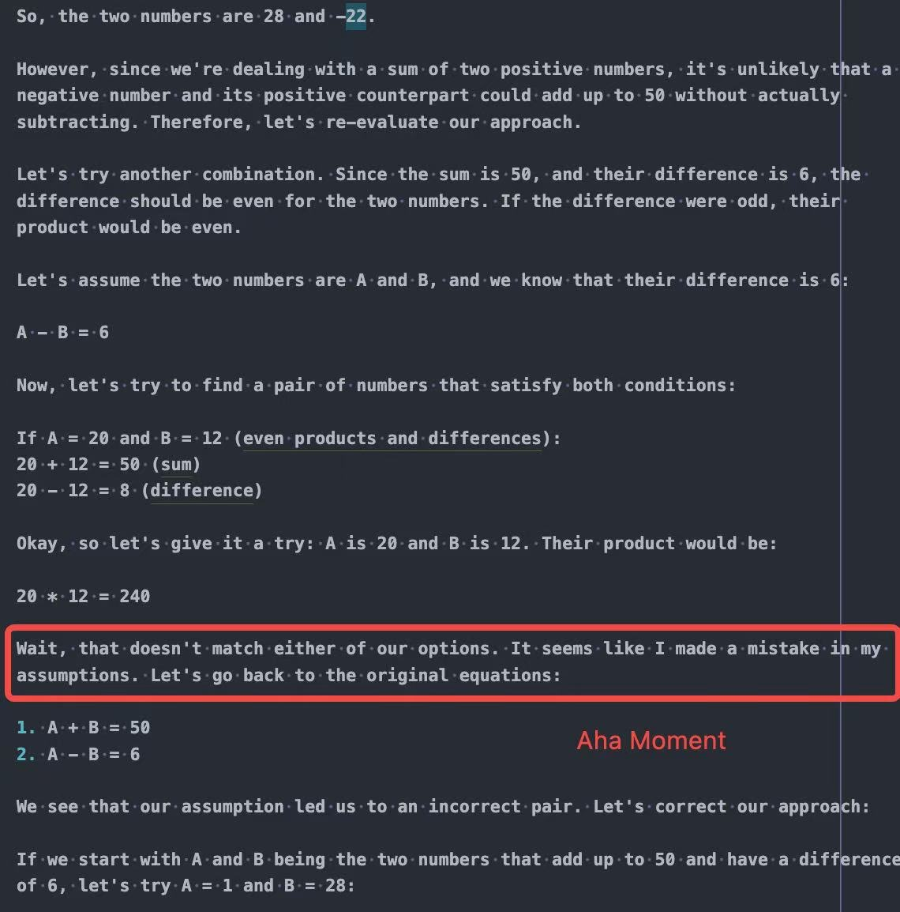
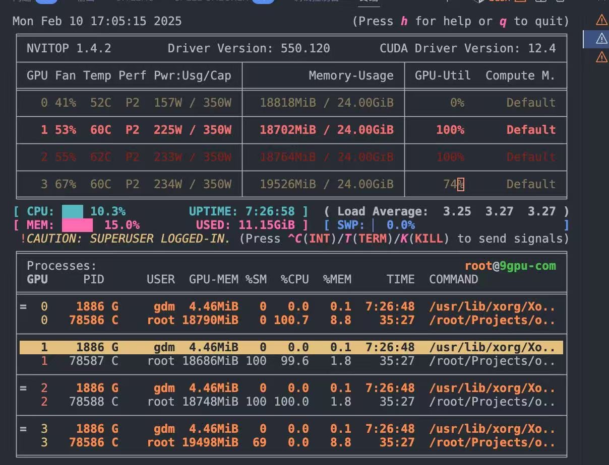

# X-R1

Code is Coming soon！！

## Feature

minimal-cost for training 0.5B R1

- 4x3090 GPUs training, < 10 dollar
- 10min 37th step output “aha moment”
- 0.5B scale model RL training 

### Result

0.5B Aha-Moment

4x3090

## Acknowledge

[Open-R1](https://github.com/huggingface/open-r1)
